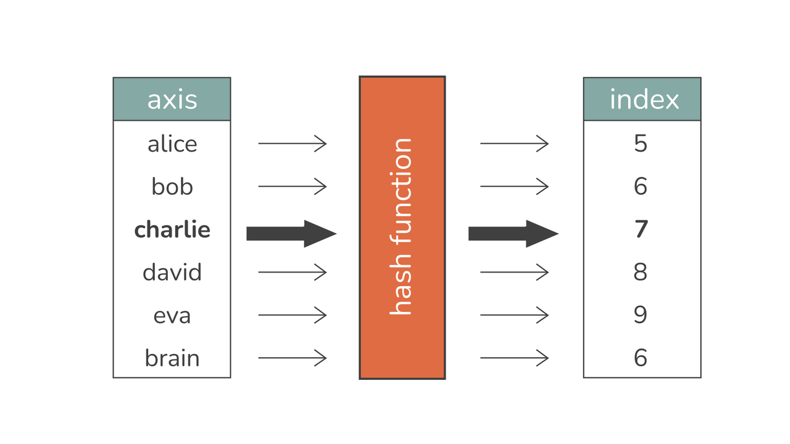
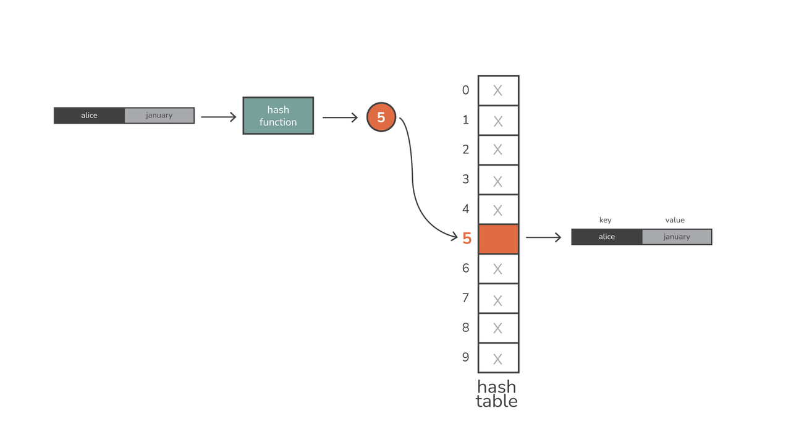
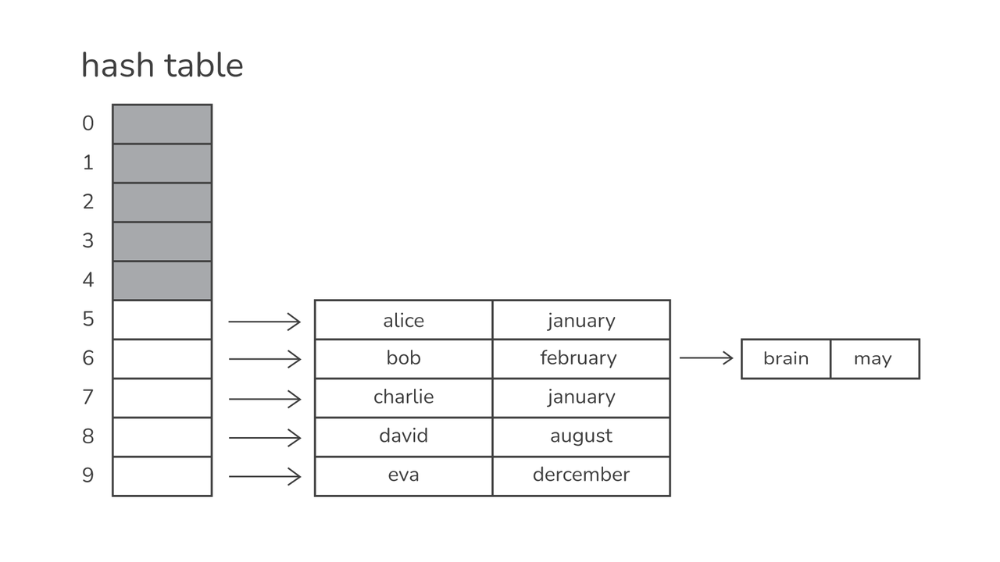

# Tutoriat 3

## Table of contents
- [Introducere](#introducere)
- [Hash Tables](#hash-tables)
- [Seturi](#seturi)
- [Dicționare](#dictionare)
- [Exerciții](#exerciții)

## Introducere
În acest tutoriat, vom explora trei structuri de date esențiale în Python: **hash tables**, **seturi** și **dicționare**. Aceste structuri sunt similare cu cele din C++ (precum `unordered_map` și `set`), dar sunt mult mai ușor de utilizat în Python, datorită sintaxei simplificate și funcțiilor integrate.

## Hash tables
**Hash table** este o structură de date ce mapează o cheie la o valoare. Intr-un hash table, datele sunt stocate intr-un format de liste, dar fiecare valoare are cheia sa proprie, folosita la a identifica valoarea. Din asta rezulta performanta buna in a lua valori din hash tables.
În Python, acestea sunt implementate prin dicționare (`dict`).

De exemplu, avem urmatorul hash table care retine pentru mai multi oameni, luna in care s-au nascut. Cheile sunt numele oamenilor, iar valorile sunt lunile.
```
+-----------------------+
|   Key   |   Value     |
+-----------------------+
| Alice   | January     |
| Bob     | May         |
| Charlie | January     |
| David   | August      |
| Eve     | December    |
| Brain   | May         |
+-----------------------+
```

Pentru a gasi in ce luna este Alice nascuta (odata ce am stocat intr-un hash table valorile), trebuie sa gasim o cale de a afla index-ul din lista la care se afla Alice (pentru ca am zis ca in spate, hash tables sunt reprezentate ca liste). Aici intervine **hash function**. Un hash function primeste o valoare de tip cheie (in cazul nostru, va primi un nume: "Alice") si returneaza index-ul la care se afla valoarea sa.

Ce face o **functie hash** sa fie buna?
R: Sa distribuie cheile cat mai balansate in toata lista (un exemplu de asa nu: Nu vrem ca functia noastra sa returneze mereu 0, pentru ca in acest caz toate valorile ar fi una peste alta), astfel incat minimizam sansa de coliziune (cand 2 chei returneaza acelasi index)

Un exemplu de o functie hash (una foarte simpla), ar fi sa luam numele (adica cheia) si sa returnam valoarea ASCII a primei litere MODULO marimea listei

```python
def simple_hash(key, array_size):
    return ord(key[0]) % array_size
```

Functia este simpla, dar s-ar putea sa existe coliziuni, deoarece chei diferite pot incepe cu aceeasi litera (astfel indexii returnati vor fi la fel). Sa luam ca exemplu marimea listei = 10. Daca am rula functia pentru toate numele de mai sus am ajunge la:



Dupa cum puteti observa, `Bob` si `Brian` au acelasi index => coliziune.

##### De retinut: 
Functiile Hash sunt un aspect esential al eficientei tabelelor hash.



#### Cum rezolvam o coliziune?

##### Separate Chaining


##### Open Addressing
Metoda folosită de dicționarele Python pentru a gestiona coliziunile este mai sofisticată decât separate chaining. Python folosește o formă de open addressing numită „probing”.

În probing, când apare o coliziune, tabela hash verifică următorul slot disponibil și plasează acolo perechea cheie-valoare. Procesul de găsire a următorului slot disponibil se numește „probing”, iar pentru acesta se pot folosi mai multe strategii, cum ar fi:

    Probing liniar – verificarea sloturilor unul câte unul, în ordine
    Probing pătratic – verificarea sloturilor în puteri crescătoare ale lui doi

## Seturi
Un set este o colecție neordonată de elemente unice. În Python, putem folosi set() pentru a crea astfel de colecții. Seturile sunt utile pentru a elimina duplicatele și a verifica existența unor elemente într-o colecție.

### Exemple

1. Cream un set si adaugam elemente:
```python
# Set cu elemente unice
numere = {1, 2, 3, 4}
numere.add(5)
print(numere) # Output: {1, 2, 3, 4, 5}

```

2. Verificam daca un element exista in set:
```python
if 3 in numere:
    print("3 este în set")
```

3. Seturile suporta operatii de reuniune si intersectie:
```python
A = {1, 2, 3}
B = {3, 4, 5}
print(A | B)  # Reuniune: {1, 2, 3, 4, 5}
print(A & B)  # Intersecție: {3}
```

## Dictionare
Dicționarele (dict) sunt structuri de date de tip cheie-valoare, similare cu unordered_map din C++. Ele sunt implementate in spate folosind **hash tables**. Cheile pot fi de orice tip imutabil (e.g., string, int). 

### Exemple
1. Cum am tine datele in memorie daca avem nevoie sa retinem numele unor persoane si varstele? (Datele sunt citite din fisier)
Ex: 
```
Ana,20
Bogdan,30
Carmen,28
``` 
R: Creăm un dicționar pentru a asocia numele unor persoane cu vârstele lor:
   ```python
   # Hash Table folosind dicționare
   varste = {"Ana": 25, "Bogdan": 30, "Carmen": 28}
   print(varste["Ana"])  # Output: 25

   # afisare valori dictionar:
    #Metoda 1
    print(varste)

    #Metoda 2
   for (k, v) in varste.items():
    print(k, v)
   ```

2. Cum modificam numele unei persoane, deja existente in dictionar?
R:
```python
# schimbam varsta Anei
print(f'Ana are {varste["Ana"]} de ani, inainte de schimbare')

varste["Ana"] = 42

print(f'Ana are {varste["Ana"]} de ani, dupa schimbare')
```

3. Verificarea daca un nume exista deja in dictionar (cheie exista deja in dictionar)
```python
# verificam daca un nume dat exista in dictionar
nume_de_verificat = "Petre"

if nume_de_verificat in varste:
    print("Exista numele")
else:
    print("Nu exista numele")
```

4. Eliminarea unei chei din dictionar
```python
del varste["Ana"]

print(varste) # {'Bogdan': '30', 'Carmen': '28'}

del varste["Ana"] # Raises KeyError: "Ana"

print(varste.pop("Ana", "Necunoscut")) # Necunoscut
```

**Grija la accesare**:
```python
print(varste["Ana"]) # 42
print(varste["Popa"]) # Raises KeyError: 'Popa'

print(varste.get("Popa", "Necunsocut")) # Necunoscut
```


## Exercitii

1. Numără elementele unice: Creează un program care citește o listă de numere și folosește un set pentru a elimina duplicatele. Afișează setul și numărul elementelor unice.
Ex: `1, 2, 3, 4, 2, 2, 4, 6, 7, 1`
R: `6`

2. Contor de cuvinte: Scrie un program care numără de câte ori apare fiecare cuvânt într-o listă de cuvinte folosind un dicționar.
Ex: `Ana se duce la piata dimineata. Ana are foarte multa energie dimineata. Piata se deschide abia la 8.`
R: 
```
'ana': 2
'se': 2
'duce': 1
'la': 2
'piata': 2
'dimineata': 2
...
```

3. Creează două seturi de numere întregi și realizeaza toate operatiile pe multimi (reuniune, intersectie, diferenta, diferenta simetrica).

4. Stocare și căutare de produse: Creează un dicționar care mapează produse la prețuri. Oferă utilizatorului opțiunea de a adăuga un produs nou, de a actualiza prețul unui produs existent și de a căuta prețul unui produs.

5. Dicționar de studenți: Creează un dicționar care stochează numele studenților și nota lor la un examen. Scrie funcții care adaugă un nou student, actualizează nota unui student existent și calculează media notelor.