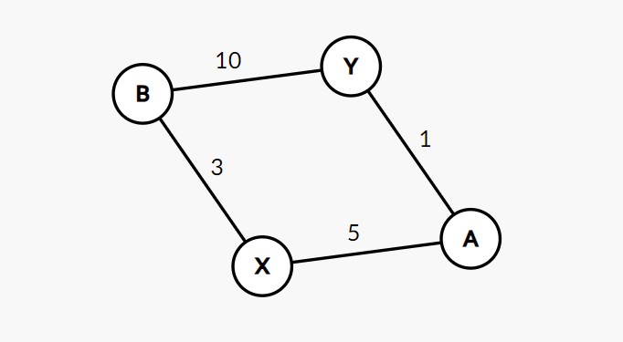

## Table of contents
- [Introducere](#1---introducere-in-tehnica-greedy)
- [Exemple](#2---exemple)
- [Exercitii](#3---exercitii)

---

## 1 - Introducere In Tehnica Greedy
#### 1.1. La ce se foloseste?
Tehnica de programare <b>Greedy</b> este (uneori) utilizata in probleme de optimizare de tipul urmator: <b>se da o multime A; sa se determine o submultime B (din A), astfel incat ... (conditii)</b>. Ideea este ca la fiecare pas vom selecta cel mai "bun" element disponibil dupa niste criterii, iar aceste rezultate vor fi combinate pentru a obtine o solutie finala. Asadar, noi aflam un <b>optim global</b> combinand <b>optimele locale</b>.

<b>Ce sunt optimele locale si globale?</b> Sa luam, de exemplu, distanta dintre 2 puncte <b>X</b> si <b>Y</b> pe un graf. In graful de mai jos, distanta minima de la <b>X</b> la <b>Y</b> este data de muchiile <b>(X, A)</b> si <b>(A, Y)</b> (5+1=6), acesta fiind <b>optimul global</b> (solutia finala). Totusi, daca ar fi sa luam muchia de lungime minima incepand din <b>X</b>, aceasta ar fi <b>(X, B)</b>; chiar daca nu este o alegere corecta pentru solutia finala, ea este un <b>optim local</b> (cel mai scurt drum la pasul respectiv). Dupa cum se poate observa, combinarea <b>optimelor locale</b> nu furnizeaza intotdeauna un <b>optim global</b> corect.



#### 1.2. Structura unei rezolvari Greedy
Deoarece la fiecare pas incercam sa selectam cel mai bun element disponibil, ar avea sens ca, in principal, sa sortam datele de intrare dupa anumite criterii si apoi sa parcurgem elementele (totusi nu e intotdeauna necesar).

Sa presupunem ca avem un vector de numere intregi si vrem sa gasim o submultime cat mai mica (numar minim de elemente), astfel incat suma elementelor submultimii sa fie mai mare decat suma restul elementelor din multimea principala care n-au fost incluse in submultime; intuitia ar fi sa sortam lista si sa selectam la fiecare pas cel mai mare element neinclus in submultime, pana cand depasim suma => tehnica <b>Greedy</b> cu complexitate <b>O(nlogn)</b>. Structura acestei probleme (si problemelor de tip <b>Greedy</b>) arata in felul urmator:

```python
# 1. citim datele de intrare (in cazul nostru - vectorul de intregi A)
A = [4, 3, 1, 6, 2]

# 2. facem o prelucrare a datelor de intrare (in general sortari dupa un criteriu)
# in cazul nostru, vrem cele mai mari numere (sortam invers dupa valoare)
A.sort(reverse = True)

# submultimea B (solutia noastra) trebuie sa indeplineasca urmatoarea conditie:
# sum(B) > sum(A) - sum(B) <=> 2 * sum(B) > sum(A) <=> sum(B) > sum(A) / 2
B = []
suma_A = sum(A) / 2
suma_B = 0

# 3. parcurgem elementele din lista
for num in A:
    # 4. verificam daca elementul curent indeplineste criteriul de selectie si il adaugam
    # unele probleme vor avea criterii de selectie mai complexe
    if suma_B <= suma_A:
        B.append(num)
        suma_B += num
    else:
        break
        
# 5. afisam solutia
print(B)
```

Este important de stiut ca, in principal, rezolvarile <b>Greedy</b> vor avea complexitate <b>O(nlogn)</b> din cauza sortarilor, dar exista si probleme unde nu trebuie sa facem prelucrari pe datele de intrare, deci vor lipsi sortarile, iar complexitatea finala va depinde de dimensiunea datelor de intrare.

#### 1.3. Corectitudinea solutiilor Greedy
In general, demonstratiile pentru corectitudinea problemelor rezolvate cu Greedy nu au neaparat o structura care poate fi urmata; fiecare demonstratie difera putin, dar majoritatea rezolvarilor sunt intuitive, iar argumentarile nu vor fi grele.

De exemplu, pentru problema anterioara cu sume - solutia furnizata de tehnica Greedy este <b>G = [6, 4]</b>. Sa presupunem ca exista o alta solutie mai buna: asta ar insemna ca solutia optima contine mai putine elemente (in cazul nostru - ar avea un element). Evident, acel element ar fi mai mare decat elementul <b>6</b> din solutia <b>G</b>. Totusi, daca acest lucru ar fi fost adevarat, atunci algoritmul Greedy pe care l-am scris l-ar fi selectat si l-ar fi inclus in solutie; algoritmul selecteaza mereu cel mai mare element posibil. In concluzie, presupunerea noastra a fost falsa iar solutia <b>G</b> este optima, avand numarul minim de elemente posibil.

Vor mai fi 2 exemple de probleme rezolvate mai jos, impreuna cu demonstratii similare pentru corectitudine.
 
#### 1.4. In ce situatii nu functioneaza Greedy?
De obicei, problemele Greedy satisfac 2 proprietati:
1. <b>Proprietatea substructurii optime</b> - o problema indeplineste aceasta proprietate in cazul in care solutia optima contine solutii optime ale subproblemelor.
2. <b>Proprietatea alegerii greedy</b> - se poate ajunge la solutia optima globala a problemei, efectuand alegeri optime locale. Solutia optima a problemei fie este construita prin tehnica Greedy, fie poate fi transformata intr-o alta solutie optima pe baza acestei tehnici.

Asa cum am mentionat si inainte, combinarea <b>optimelor locale</b> uneori nu rezulta intr-un <b>optim global</b> corect. Cateodata este util sa avem si proprietatile de mai sus in minte, dar cel mai practic este sa gasim un contraexemplu unde selectarea unui optim local va conduce la o solutie mai putin buna.

Sa spunem ca vrem sa platim o suma de <b>10</b> lei utilizand cat mai putine bancnote, avand la dispozitie un numar nelimitat de bancnote de <b>1</b>, <b>2</b> sau <b>4</b> lei. La fiecare pas, incercam sa platim de cat de multe ori putem cu cea mai mare bancnota posibila => sortam bancnotele descrescator dupa valoare; platim de doua ori cu <b>4</b> lei si o data cu <b>2</b> lei, asadar solutia optima consta in 3 bancnote.

Daca vrem sa platim aceeasi suma de <b>10</b> lei cu bancnote de <b>1</b>, <b>5</b> si <b>7</b> lei si aplicam iar tehnica <b>Greedy</b>, algoritmul va da gres. Logica ramane aceeasi - sortam descrescator bancnotele si incercam sa platim cu cele mai mari disponibile: una de <b>7</b> lei si trei de <b>1</b> leu => 4 bancnote in total, dar solutia optima se obtine realizand plata cu doua bancnote de <b>5</b> lei.

---

## 2 - Exemple
#### Exercitiul 1
<b>Cerinta</b>: Gigel este un cantaret incepator. El stie sa cante <b>N</b> piese, iar pentru fiecare piesa se cunoaste durata (exprimata in minute si secunde). Gigel va participa la o emisiune de televiziune, unde va putea canta timp de <b>T</b> secunde. El vrea sa cante cat mai multe piese, pentru a-si demonstra talentul deosebit. In fisierul <b>"piese.in"</b> se gasesc toate piesele din repertoriu, cu durata in minute si secunde. Sa se scrie in fisierul <b>"piese.out"</b> melodiile care au fost selectate sa fie interpretate, cu durata fiecareia (in secunde) si durata totala.

```
piese.in
600s
Piesa 1 03m22s
Piesa 2 02m28s
Piesa 3 04m05s
Piesa 4 01m56s
Piesa 5 02m30s
Piesa 6 03m15s
Piesa 7 04m40s
Piesa 8 03m00s
```

```
piese.out
Piesa 4: 116s
Piesa 2: 148s
Piesa 5: 150s
Piesa 8: 180s
Durata totala: 594/600
```

<b>Intuitie</b>: vrem sa avem cat mai multe piese, deci le selectam pe cele cu duratele cele mai scurte. Sortam piesele dupa durata (prelucrare a datelor de intrare) si incercam sa includem cat mai multe, avand grija sa nu depasim durata totala de <b>T</b> secunde.

```python
# 1. citirea datelor
# o piesa va fi memorata intr-un tuplu de forma (nr_piesa, durata_secunde)
with open("piese.in") as f:
    T = int(f.readline()[:-2])
    t = []
    for linie in f:
        aux = linie.split()
        t.append((int(aux[1]), int(aux[2][:2]) * 60 + int(aux[2][3:5])))

# 2. prelucrarea datelor
sol = []
aux = T 
t.sort(key = lambda x: x[1]) # sortam ca sa avem piesele cu cea mai scurta durata

# 3. parcurgerea elementelor
for piesa in t:
    # 4. criteriul de selectie
    # cat timp nu depasim durata T, adaugam cea mai scurta piesa
    if aux - piesa[1] < 0:
        break
    aux -= piesa[1]
    sol.append(piesa)

# 5. afisarea solutiei
with open("piese.out", "w") as g:
    for piesa in sol:
        g.write(f"Piesa {piesa[0]}: {piesa[1]}s\n")
    g.write(f"Durata totala: {T - aux}/{T}\n")
```

<b>Argumentarea corectitudinii</b>: presupunand ca ar exista o solutie mai buna decat solutia furnizata, asta ar insemna ca solutia optima ar avea (macar) o piesa in plus. In acest caz, ar exista piese in datele de intrare cu durate mai scurte, care nu au fost incluse (de exemplu - noi am selectat o piesa mai lunga care ar fi putut sa fie inlocuita cu alte 2 piese mai scurte, deci putem sa facem rost de o piesa in plus). Acest lucru nu este posibil, deoarece algoritmul nostru a sortat crescator piesele si le-a selectat mereu pe cele mai scurte, asadar este imposibil sa existe alte piese mai scurte. In concluzie, nu exista o solutie mai buna decat cea prezentata.

#### Exercitiul 2
<b>Cerinta</b>: se citeste o lista de <b>N</b> numere intregi si un numar natural <b>k (<= N)</b>. Sa se calculeze suma maxima care poate fi obtinuta (adunand elementele din lista), schimband semnul a exact <b>k</b> elemente (aflate pe pozitii distincte). Pentru lista <b>[-5, 7, -3, 4, 5]</b> si <b>k=3</b>, solutia este <b>16</b>, deoarece (-4)+5+3+7+5=16.

<b>Intuitie</b>: cand schimbam semnul la numere negative, vrem sa le alegem mai intai pe cele mai mici, deoarece <b>-X < -Y</b> dar <b>X > Y</b>. De asemenea, cand schimbam semnul la numere pozitive, le vrem pe cele mai mici: este mai ok sa schimbam <b>1</b> in <b>-1</b> decat sa schimbam <b>10</b> in <b>-10</b>.

In concluzie, sortam lista crescator (facem o prelucrare initiala a datelor de intrare). Vrem sa schimbam semnul la cele mai mici numere negative, iar daca numarul de numere negative este mai mic decat <b>k</b>, atunci vom "consuma" toate numerele negative si trecem la cele mai mici numere pozitive; asta inseamna ca, pur si simplu, luam primele <b>k</b> numere din sir si le schimbam semnul.

```python
# 1. citirea datelor de intrare
t = [4, -5, 2, 7, -1, 5, 6, -3, 4]
k = 5

# 2. prelucrarea datelor de intrare
t.sort()

suma = 0
# 3. parcurgerea elementelor
# luam primele k numere si le schimbam semnul, le adunam
for i in range(k):
    # 4. criteriul de selectie nu este necesar
    suma += (~t[i] + 1) # schimbam semnul ca la ASC :)
    
# 5. mai adunam numerele ramase, apoi afisam solutia
print(suma + sum(t[k:]))
```

<b>Argumentarea corectitudinii</b>: daca ar exista o solutie mai buna decat cea prezentata, asta ar insemna ca ar exista o suma posibila mai mare. Sunt doua moduri principale prin care acest lucru este posibil: am schimbat semnul la un numar negativ nepotrivit, sau un numar pozitiv nepotrivit. Pentru a asigura o suma maxima posibila, avem nevoie de cele mai mici numere negative, SAU toate numerele negative, SAU toate nr. negative impreuna cu cele mai mici nr. pozitive. Algoritmul de mai sus sorteaza crescator sirul de numere, asadar primele <b>k</b> numere sunt optiunile optime pentru schimbarea de semn, fiind cele mai mici numere negative, urmate de cele mai mici numere pozitive. In concluzie, este imposibil ca acest algoritm sa fi schimbat vreun semn nepotrivit, deci solutia este optima.

---

## 3 - Exercitii
### Exercitiul 1
Consideram <b>N</b> galeti pline cu apa (<b>1 <= N <= 10000</b>) cu proprietatea ca in orice galeata, mai putin in cea avand capacitatea minima, se gaseste o cantitate de apa strict mai mare decat suma capacitatilor galetilor mai mici. Oricare dintre cele <b>N</b> galeti poate fi desertata intr-un bazin cu capacitate <b>C</b>, insa doar complet. Scrieti un program care sa citeasca de la tastatura capacitatile celor <b>N</b> galeti si capacitatea <b>C</b> a bazinului (toate numere naturale nenule), dupa care sa afiseze capacitatile galetilor care ar trebui sa fie desertate in bazin pentru a-l umple complet (sau un mesaj corespunzator daca nu este posibil).

```
galeti.in
6
30 6 62 5 133 14
```

```
galeti.out
133 14 6
```

### Exercitiul 2
Maria este studenta in anul I la informatica si a primit o lista de <b>N</b> probleme (numerotate de la <b>1</b> la <b>N</b>) pe care trebuie sa le rezolve la cursul de algoritmica, rezolvarea unei probleme durand exact o unitate de timp. Pentru ca profesorul vrea sa testeze capacitatea elevilor de a face cele mai bune alegeri, fiecare problema are un anumit punctaj si un numar limita de unitati de timp pana la care poate fi rezolvata. Scrieti un program care determina punctajul maxim pe care il poate obtine Maria.

```
probleme.in
4
10 3
7 5
8 1
2 1
```

```
probleme.out
Punctaj maxim: 25
Problema 3: 8 1
Problema 1: 10 3
Problema 2: 7 5
```

### Exercitiul 3
Consideram <b>N</b> spectacole care vor avea loc in aceeasi zi si pentru care cunoastem intervalele de desfasurare. Avand la dispozitie o singura sala in care putem sa planificam un singur spectacol la un moment dat, sa se determine numarul maxim de spectacole care pot fi planificate fara suprapuneri. Justificati corectitudinea si complexitatea algoritmului.

```
spectacole.in
7
Spectacol 1: 10:00 - 11:20
Spectacol 2: 09:30 - 12:10
Spectacol 3: 08:20 - 09:50
Spectacol 4: 11:30 - 14:00
Spectacol 5: 12:10 - 13:10
Spectacol 6: 14:00 - 16:00
Spectacol 7: 15:00 - 15:30
```

```
spectacole.out
Spectacol 3: 08:20 - 09:50
Spectacol 1: 10:00 - 11:20
Spectacol 5: 12:10 - 13:10
Spectacol 7: 15:00 - 15:30
```

### Exercitiul 4
O balanță veche s-a defectat și acum se echilibrează nu doar pentru două obiecte având
aceeași greutate, ci pentru oricare două obiecte cu proprietatea că modulul diferenței dintre greutățile lor este mai mic (sau egal) decât un număr real <b>G</b>. Scrieți un program care citește de la tastatură un număr natural <b>N</b>, un număr real <b>G</b> și greutățile a <b>N</b> obiecte, după care afișează pe ecran numărul maxim de perechi de obiecte care echilibrează balanța defectă, precum și perechile respective, știind că orice obiect poate să facă parte din cel mult o pereche. Fiecare pereche afișată trebuie să fie de forma <b>X + Y</b>, unde <b>X</b> și <b>Y</b> sunt numerele de ordine ale celor două obiecte din pereche (obiectele sunt numerotate începând de la 1). Greutățile tuturor obiectelor și diferența <b>G</b> sunt exprimate prin numere reale strict pozitive, reprezentând grame. Nu contează ordinea în care se vor afișa perechile de obiecte pe ecran și nici ordinea numerelor de ordine ale obiectelor dintr-o pereche.

```
balanta.in
10
8.5
21.25
12
6.05
20.7
23.8
22
33.25
21
48.15
62.20
```

```
balanta.out
3
6 + 5
8 + 1
3 + 2
```

### Exercitiul 5
În vitrina magazinului CheapLuxury bijuteriile din aur sunt așezate pe <b>m ≥ 3</b> rânduri, iar pe fiecare rând sunt câte <b>n ≥ 3</b> bijuterii. Hoțul Gicuță vrea să spargă vitrina magazinului și să fure bijuteriile, dar, deoarece sistemul de alarmă al magazinului este foarte performant, el își dă seama că are nevoie de un plan bine pus la punct. În acest scop, Gicuță se gândește să fure de pe fiecare din cele <b>m</b> rânduri câte o singură bijuterie, astfel încât valoarea totală a acestora să fie maximă și, fiind lacom, vrea ca valoarea fiecărei bijuterii să fie strict mai mare decât valoarea bijuteriei furate de pe rândul precedent. 

Scrieți un program care citește de la tastatură două numere naturale nenule <b>m</b> și
<b>n</b>, o matrice cu <b>m</b> linii și <b>n</b> coloane care conține pe linia <b>i</b> valorile bijuteriilor de pe rândul <b>i</b> exprimate în euro, după care afișează pe ecran, în forma indicată în exemplu, valoarea
totală a bijuteriilor pe care trebuie să le fure Gicuță, precum și pozițiile acestora
(rândurile sunt considerate ca fiind numerotate de la <b>1</b>, la fel și pozițiile bijuteriilor în cadrul unui rând). Dacă nu există nicio modalitate de a fura bijuteriile conform restricțiilor indicate, atunci programul va afișa mesajul <b>"Imposibil"</b>.

```
bijuterii.in
4 3
515.99 350.79 731.25
299.99 515.88 766.10
566.25 271.99 444.89
865.99 918.55 799.99
```

```
bijuterii.out
2351.47
1 2
2 2
3 1
4 2
``` 

### Exercitiul 6
Se organizează un concurs de tip trivia în limbajul Python la care participă nea Vasile
împreună cu alți <b>N</b> oameni. Fiecărui om din cei <b>N</b> i se asociază o valoare strict pozitivă <b>𝑋𝑖</b>, mai puțin lui Vasile căruia i se asociază implicit valoarea <b>0</b> (practic, Vasile este complet subestimat atât de către organizatori, cât și de ceilalți participanți). Concursul se desfășoară în mai multe runde eliminatorii, până când rămâne un singur om care este declarat câștigătorul. Într-o rundă la care participă <b>K</b> oameni (inclusiv Vasile!) sunt eliminați toți cei care nu știu răspunsul corect la întrebarea respectivă, iar scorul rundei se calculează ca fiind <b>(∑ 𝑋𝑖) / 𝐾</b>
pentru toți indicii <b>𝑖</b> ai oamenilor eliminați în runda respectivă. Câștigătorul concursului va primi o sumă de bani egală cu suma scorurilor tuturor rundelor. Nea Vasile știe tot ceea ce s-ar putea ști despre limbajul Python (adică este imposibil ca el să piardă concursul!), deci îl interesează doar să afle suma maximă de bani pe care ar putea să o câștige.

Scrieți un program Python care să citească de la tastatură numărul natural nenul <b>𝑁</b>, reprezentând numărul de concurenți (în afară de nea Vasile) și cele <b>𝑁</b> numere strict pozitive asociate celor <b>𝑁</b> participanți (separate între ele prin câte un spațiu), după care afișează un
singur număr real (cu 3 zecimale) reprezentând suma maximă de bani pe care ar putea să o
câștige nea Vasile. 

```
concurs.in
2
6 6
```

```
concurs.out
5
```