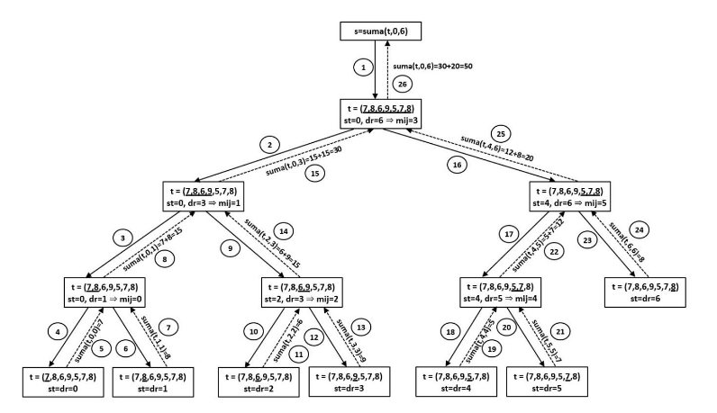
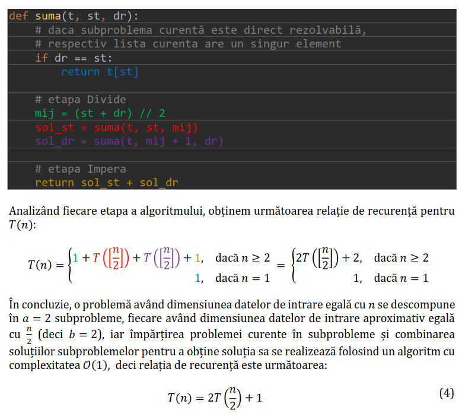
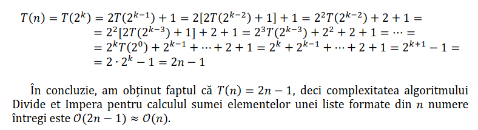
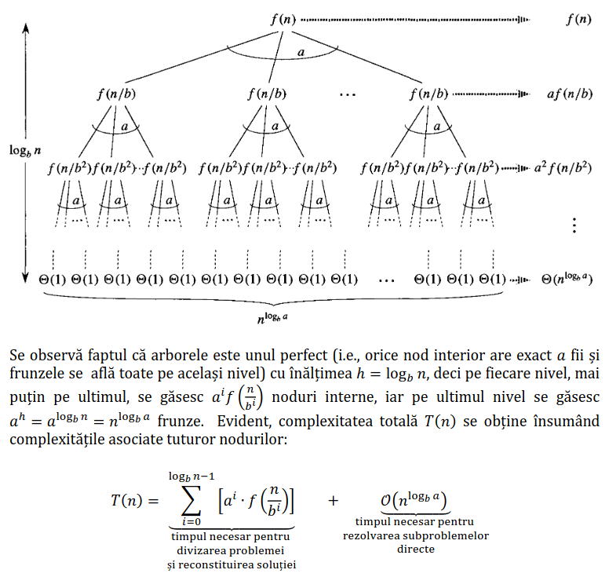
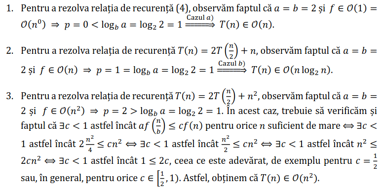
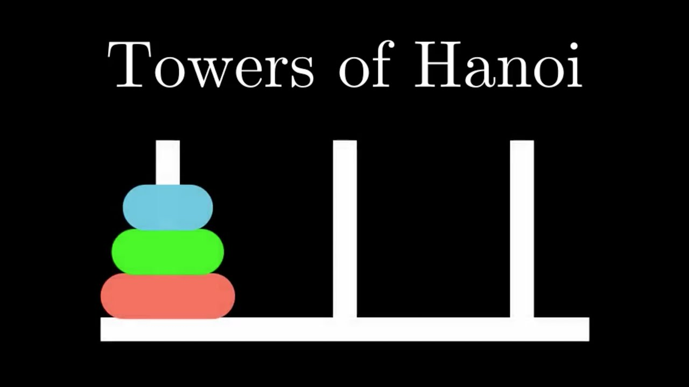

# Divide et Impera / Divide and Conquer

## Table of contents

1. [Ce este Divide et Impera](#ce-este-divide-et-impera)
2. [Pasii pentru un algoritm de tip Divide et Impera](#pasii-pentru-un-algoritm-de-tip-divide-et-impera)
3. [Ce tipuri de probleme rezolva](#ce-tipuri-de-probleme-rezolva)
4. [Determinarea complexitatii unui algoritm de tip Divide et Impera](#determinarea-complexitatii-unui-algoritm-de-tip-divide-et-impera)
5. [Exemple](#exemple)
6. [Exercitii](#exercitii)

## Ce este Divide et Impera?

Tehnica de programare **Divide et Impera** (sau Divide si Cucereste) consta in descompunerea repetata a unei probleme in subprobleme de acelasi tip pana cand se obtin probleme direct rezolvabile (Partea de **DIVIDE**), dupa, rezolvam subproblemele in mod independent (Partea de **IMPERA**) si apoi, in sens invers, vrem sa combinam solutiile gasite, pentru a gasi solutia la problema noastra initiala (Partea de **COMBINARE**).
Divide et Impera este o **tehnica recursiva** (poate fi si iterativ, dar rar).

Exemplu de a calcula suma elementelor unei liste

```python
def suma(L, st, dr):
    if st == dr:
        return L[st]
    mid = (st + dr) // 2
    return suma(L, st, mid) + suma(L, mid + 1, dr)
```

Pentru a putea face ca mai sus, vrem sa avem o relatie de tipul:

$$
    suma(L, st, dr) = 
    \begin{cases} 
    \text{t[st],} & st = dr \\ 
    \text{suma(L, st, mij) + suma(L, mij+1, dr),} & st<dr
    \end{cases}$$
unde mij = (st + dr) / 2

De exemplu, pentru L = [7, 8, 6, 9, 5, 7, 8]



## Pasii pentru un algoritm de tip Divide et Impera

1. **Divide**
- Imparte problema in subprobleme
- Fiecare subproblema trebuie sa reprezinte o parte a problemei originale
- Obiectivul este sa impartim problema pana cand nu o mai putem imparti

2. **Impera**
- Rezolva fiecare subproblema individual
- Obiectivul este sa gasim solutii la aceste subprobleme in mod independent

3. **Combina**
- Combina solutiile subproblemelor pentru a obtine solutia finala

Algoritm general:
```python
# functie care furnizeaza solutia unei probleme combinand solutiile
# subproblemelor in care ea a fost descompusa
def combinare(sol_st, sol_dr):
    pass
def divimp(t, st, dr):
    # daca subproblema curentă este direct rezolvabilă
    if dr-st <= k: # k este, de obicei, 0 sau 1
        return solutie_problema_directa
    # etapa Divide
    mij = (st + dr) // 2
    sol_st = divimp(t, st, mij)
    sol_dr = divimp(t, mij+1, dr)

    #etapa Merge
    return combinare(sol_st, sol_dr)
```

## Ce tipuri de probleme rezolva?

Pentru ca o problema sa poata fi rezolvata cu tehnica Divide et Impera, trebuie sa respecte urmatoarele 3 conditii:
1. conditia **Divide**: problema poate fi descompusa in doua (sau mai multe) subprobleme de acelasi tip
2. conditia **Impera**: subproblema poate fi rezolvata in mod independent (nu e nevoie de solutia de la o alta subproblema)
3. conditia **Combina**: solutia unei probleme se poate obtine prin combinarea solutiilor la subprobleme

De exemplu:
Putem calcula suma elementelor unei liste L prin:
- impartim lista L, in mod repetat, in doua jumatati pana cand ajungem la liste cu un singur element
- calculam suma pentru listele cu un singur element (practic nu avem ce calcula)
- partea de combinare este ca adunam solutiile gasite


## Determinarea complexitatii unui algoritm de tip Divide et Impera

1. Gasirea unei relatii de recurenta care sa exprime complexitatea T(n) a rezolvarii unei probleme având dimensiunea datelor de intrare egală cu 𝑛 în raport de timpul necesar rezolvării subproblemelor în care aceasta este descompusă și de complexitatea operației de combinare a soluțiilor lor pentru a obține soluția problemei inițiale. 

Presupunând faptul că orice problemă se descompune în 𝑎 subprobleme, fiecare având dimensiunea datelor de intrare aproximativ egală cu n/b, iar împărțirea problemei curente în subprobleme și combinarea soluțiilor subproblemelor pentru a obține soluția sa se realizează folosind un algoritm cu complexitatea 𝑓(𝑛), se obține foarte ușor forma generală a relației de recurență căutate:

<p style="text-align: center;"> T(n) = aT(n/b) + f(n) (3) </p>
, unde a >= 1, b > 1, f(n) functie asimptotica pozitiva. De asemenea, vom presupune T(1) ∈ O(1).

Pentru exemplul cu suma:



2. Rezolvarea relatiei de recurenta de mai sus, utilizand diverse metode matematice, pentru a determina expresia analitica a lui T(n). Doua dintre cele mai utilizate tehnici sunt: **iterarea directa a relatiei de recurenta** si **teorema master**
---
**Metoda 1**: Iterarea directa a relatiei de recurenta

Iteram relatia de recurenta pana cand vom ajunge la T(1) sau T(0), care sunt ambele O(1) fiind complexitatile unor probleme direct rezolvabile. Vom presupune ca n = 2<sup>k</sup> si o vom itera astfel:



**Metoda 2**: Teorema master

A doua metodă constă în utilizarea teoremei master pentru a afla direct soluția analitică a unei relații de recurență de tipul (3): 𝑇(𝑛) = 𝑎𝑇(n/b) + 𝑓(𝑛). Arborele de recursie asociat unei relații de recurență de acest tip este următorul:



**Teorema master**: Fie o relatie de recurenta de forma (3) si presupunem faptul ca f ∈ O(n<sup>p</sup>). Atunci:  
a) daca p < log<sub>b</sub>a, atunci T(n) ∈ O(n<sup>log<sub>b</sub>a</sup>);  
b) daca p = log<sub>b</sub>a, atunci T(n) ∈ O(n<sup>p</sup> log<sub>2</sub>n);  
c) daca p > log<sub>b</sub>a si ∃c < 1 astfel incat af(n/b) <= cf(n) pentru orice n suficient de mare, atunci T(n) ∈ O(f(n))   

 
**Exemple**:  
  
  
  
## Exemple

1. Gaseste elementul maxim dintr-o lista L

```python
def gaseste_maxim(a, st, dr):
    # daca st ajunge mai mare decat dr, returneaza
    # cel mai mic numar posibil
    if st > dr:
        return float('-inf')
    # daca subproblema are un singur element, returneaza elementul
    if st == dr:
        return a[st]
    mid = (st + dr) // 2
    # Gaseste maximul pentru subproblema din stanga
    left_max = gaseste_maxim(a, st, mid)
    # Gaseste maximul pentru subproblema din dreapta
    right_max = gaseste_maxim(a, mid + 1, dr)
    # Returneaza maximul dintre cele 2 jumatati
    return max(left_max, right_max)
```

2. Quick sort
```python
def quickSort(arr[], st, dr) {
  if (st < dr) {
    // pi is partitioning index,
    // arr[pi] is now at right place
    pi = partition(arr, st, dr);
    
    quickSort(arr, st, pi - 1);
    
    quickSort(arr, pi + 1, dr);
  }
}

# Function to find the partition position
def partition(array, st, dr):

    # selecteaza pivotul (elementul cel mai din dreapta)
    pivot = array[dr]

    # index pt elementul mai mare
    i = st - 1

    # itereaza prin toate elementele
    # compara fiecare element cu pivotul
    for j in range(st, dr):
        if array[j] <= pivot:

            # daca gasim element mai mic decat pivotul
            # schimba-l cu elementul mai mare tinut de i
            i = i + 1

            # interschimbam elementul de la poz i cu el de la poz j
            (array[i], array[j]) = (array[j], array[i])

    # interschimbam pivotul cu elementul de la pozitia i + 1
    (array[i + 1], array[dr]) = (array[dr], array[i + 1])

    # returnam pozitia de la care partitia a fost facuta
    return i + 1
```

Quicksort folosind list comprehensions:
```python
def quicksort(arr):
    if len(arr) <= 1:
        return arr
    else:
        pivot = arr[0]
        left = [x for x in arr[1:] if x < pivot]
        right = [x for x in arr[1:] if x >= pivot]
        return quicksort(left) + [pivot] + quicksort(right)
```

## Exercitii

1. **Turnul din Hanoi**



Se dau n discuri de dimensiuni diferite și trei tije: A, B și C. Inițial, toate discurile sunt stivuite pe tija A, în ordinea descrescătoare a dimensiunilor (cel mai mare disc este la bază). Scopul este să mutați toate discurile pe tija C, respectând următoarele reguli:

1. Se poate muta un singur disc o dată.
2. Un disc poate fi așezat doar peste un alt disc mai mare sau pe o tijă goală.
3. Se pot folosi cele trei tije pentru stocare temporară.

Scrieți un algoritm care determină pașii necesari pentru a muta toate discurile de pe tija A pe tija C, folosind tehnica divide et impera.

Exemplu:

Input: n=3

Output:

``` 
Mută discul 1 de pe A pe C.
Mută discul 2 de pe A pe B.
Mută discul 1 de pe C pe B.
Mută discul 3 de pe A pe C.
Mută discul 1 de pe B pe A.
Mută discul 2 de pe B pe C.
Mută discul 1 de pe A pe C.
```

2. **NrXDivImp**

Folosind metoda Divide et Impera, scrieți funcția recursivă cu antetul

```
def NrXDivImp(L, st, dr, x)
```

care primind ca parametri un vector L de numere întregi și trei numere întregi st, dr și x, returnează numărul de apariții ale numărului x în vectorul secvența a[st], a[st+1], ..., a[dr].

Exemplu:
Dacă a = (2,5,1,5,3,5,5,5,7,6), atunci NrXDivImp(a, 1, 6, 5) = 3, deoarece în secvența 2,5,1,5,3,5 numărul 5 apare de 3 ori. De asemenea, NrXDivImp(a, 9, 10, 5) = 0.

3. **AlternDivImp**

Folosind metoda Divide et Impera, scrieți funcția recursivă cu antetul
```
def AlternDivImp(L, st, dr)
```
care primind ca parametri un vector L de numere naturale și două numere întregi st și dr, returnează 1 dacă în secvența a[st], a[st+1], ..., a[dr] numerele impare alternează cu cele pare, sau returnează 0 dacă există cel puțin două numere alăturate de aceeași paritate.

Exemplu:
Dacă a = (1,2,3,4,5,6,7,8,9,11), atunci AlternDivImp(a, 1, 10) = 0, deoarece numerele 9 și 11 aflate pe poziții alăturate au aceeași paritate. De asemenea, AlternDivImp(a, 1, 8) = 1.
