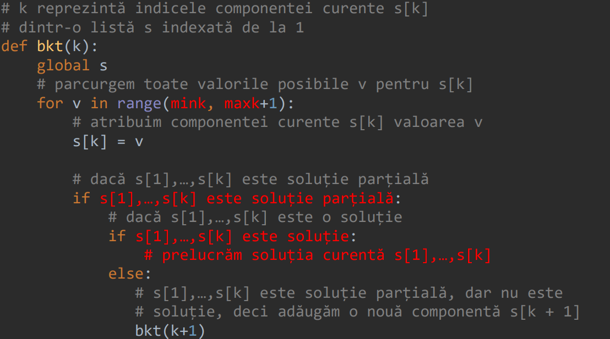

## Table of contents
- [Introducere](#1---introducere-in-tehnica-backtracking)
- [Exemple](#2---exemple)
- [Structura](#3---structura-unei-rezolvari)
- [Exercitii](#4---exercitii)

---

## 1 - Introducere In Tehnica Backtracking
Este utilizata pentru determinarea tuturor solutiilor unei probleme in mod progresiv; fiecare solutie se construieste componenta cu componenta, iar la fiecare pas este testata validitatea solutiei. 

Cand se introduce o noua componenta, sunt 2 posibilitati - solutia construita pana in acel punct este valida si se trece la urmatoarea componenta; altfel, componenta respectiva a invalidat solutia si trebuie sa fie scoasa.

---

## 2 - Exemple
### 2.1. Cutia cu moneda
Avem 5 cutii, dintre care 4 sunt goale si una are o moneda. Vrem sa ajungem sa gasim cutia care contine moneda. Cum procedam?

<b>Programare dinamica</b>: aceasta tehnica esueaza, deoarece nu putem imparti problema in subprobleme. Fiecare cutie este independenta; nu obtinem informatii despre o cutie in particular daca deschidem alta cutie.

<b>Greedy</b>: fiecare cutie are o probabilitate de 1/5 sa contina moneda. Nu exista criterii dupa care sa selectam un optim local.

<b>Backtracking</b>: exploram fiecare posibilitate pana cand gasim o solutie valida, adica vom deschide fiecare cutie pana cand gasim moneda.

### 2.2. Aranjamente
Vrem sa construim si sa afisam aranjamente de <b>N</b> luate cate <b>K</b>; de exemplu, aranjamente de <b>4</b> luate cate <b>3</b>.

Exploram, in ordine, fiecare solutie: construim componenta cu componenta cu elemente de la <b>1</b> la <b>N</b> si scapam de solutiile invalide, pana cand ajungem la <b>K</b> elemente. Pentru a gasi prima solutie din toate aranjamentele posibile, pasii din procesul de adaugare si eliminare a componentelor vor arata in felul urmator: <b>(1) -> (1 1) -> (1) -> (1 2) -> (1 2 1) -> (1 2) -> (1 2 2) -> (1 2) -> (1 2 3)</b>. 

Odata ce am construit prima solutie, urmatoarea solutie se construieste astfel: <b>(1 2 3) -> (1 2) -> (1) -> (1 3) -> (1 3 1) -> (1 3) -> (1 3 2)</b>.

---

## 3 - Structura unei rezolvari

---

## 4 - Exercitii
1. Un numar natural se numeste <b>p-marginit (0 <= p <= 9)</b> daca valoarea absoluta a diferentei dintre oricare 2 cifre ale sale este cel mult egala cu <b>p</b>. De exemplu, numarul 27383 este <b>6-marginit</b>, iar numarul 2022 este <b>2-marginit</b>. Scrieti un program care citeste numerele naturale <b>p</b> si <b>c</b>, dupa care afiseaza toate numerele naturale <b>p-marginite</b> formate din cifre nenule avand suma cifrelor egala cu <b>c</b> sau mesajul <b>"Imposibil"</b> daca nu exista astfel de numere.
<b>CONDITIE EXTRA</B>: 

2. Intr-o serie sunt <b>nrf</b> studente <b>(1 <= nrf <= 30)</b> identificate prin numerele naturale de la <b>1</b> la <b>nrf</b>, si <b>nrb</b> studenti <b>(1 <= nrb <= 30)</b> identificati prin numerele naturale de la <b>nrf + 1</b> la <b>nrf + nrb</b>. Scrieti un program care sa citeasca 3 numere naturale <b>nrf</b>, <b>nrb</b> si <b>s</b>, dupa care sa afiseze toate grupele formate din exact <b>s</b> studenti si studente <b>(2 <= s <= 100, s par)</b> cu proprietatea ca numarul studentelor din grupa este egal cu cel al studentilor (si un mesaj corespunzator daca nu exista astfel de grupe). <b>CONDITIE EXTRA</b>: sa se afiseze doar grupele din care fac parte prima studenta (<b>1</b>) si primul student (<b>nrf + 1)</b>.

3. Gospodina Ana are <b>d</b> borcane cu dulceata (<b>1 <= d <= 20</b>), identificate prin numerele naturale de la <b>1</b> la <b>d</b> si <b>m</b> borcane cu muraturi (<b>2 <= m <= 20</b>), identificate prin numerele naturale de la <b>d + 1</b> la <b>d + m</b>. Scrieti un program care citeste 2 numere naturale <b>d</b> si <b>m</b>, dupa care o ajuta pe Ana sa gaseasca toate modalitatile in care ar putea sa aseze toate cele <b>d+m</b> borcane pe un raft, pe un singur rand, astfel incat sa nu se puna 2 borcane de muraturi unul langa altul. <b>CONDITIE EXTRA</b>: sa se afiseze doar modalitatile de asezare ale borcanelor pe raft care incep si se termina cu un borcan de dulceata.

<b>Restul exercitiilor cu exemple de input si output le gasiti in folderul cu exercitii!</b>

